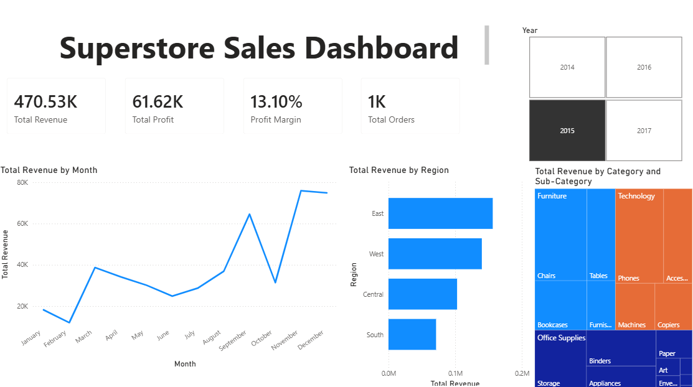

# Retail Sales KPI Dashboard

## Business Problem
Sales teams without centralised reporting rely on manual Excel 
work to track regional performance and product profitability, 
a process that is slow, inconsistent, and difficult to scale. 
This project demonstrates the end-to-end analytical workflow 
a Business Analyst would follow to replace that with a 
self-serve reporting solution.

## What I Built
An interactive Power BI dashboard analysing 9,994 rows of 
retail sales data across regions, product categories, and 
time periods. All visuals cross-filter each other. Clicking 
any data point instantly updates the entire dashboard, 
enabling dynamic, self-serve analysis without technical 
knowledge.

## Dashboard Preview


## Overall KPIs (all years combined)
| Metric | Value |
|---|---|
| Total Revenue | $2,297,201 |
| Total Profit | $286,397 |
| Overall Profit Margin | 12.5% |
| Total Orders | 5,009 |

## Key Business Insights
- **Regional gap**: West leads revenue at $725,458 but East 
  is only 7% behind at $678,781, worth investigating whether 
  East has untapped growth potential
- **Profitability vs volume**: Technology has the best profit 
  margin at 17.4% despite not always having the highest sales 
  volume, the business should prioritise Technology over 
  Furniture where margins are thin
- **Loss-making sub-categories**: Tables and Bookcases show 
  negative profit despite high sales, a clear pricing or 
  cost structure issue requiring immediate review
- **Seasonality**: Q4 shows a consistent revenue spike across 
  all four years. Inventory and staffing should be planned 
  ahead of October each year

## Technical Decisions

### Why CSV instead of a live database connection
The data was loaded directly from CSV into Power BI rather 
than via an ODBC database connection. This was a deliberate 
choice for portability (the CSV approach means anyone can 
download the repository and open the dashboard immediately 
without configuring a local database). In a production 
environment, I would connect Power BI directly to a live 
MySQL or PostgreSQL database with scheduled refresh, which 
is the approach I use in my professional work.

### Why SQL querying before Power BI
Before loading data into Power BI I explored and validated 
the dataset using SQL in DB Browser for SQLite. This step 
matters because building visuals on top of data you have 
not queried first risks surfacing errors in the dashboard 
rather than catching them in the source. The SQL queries 
confirmed row counts, identified the correct column types, 
and revealed the business insights before a single visual 
was built.

### Why DIVIDE() instead of the division operator
All profit margin calculations use DAX's DIVIDE() function 
rather than the / operator. DIVIDE() returns blank instead 
of an error when the denominator is zero — which matters 
when slicers filter to segments with no sales. Using / 
would cause the dashboard to show an error card instead 
of blank, which breaks the user experience in production 
reports.

### Why DISTINCTCOUNT on Order ID
Total Orders uses DISTINCTCOUNT rather than COUNT on Order 
ID. Each order appears across multiple rows in the dataset 
— one row per product line item. COUNT would return 9,994 
(total line items), not 5,009 (actual orders). This is a 
common data modelling mistake that produces inflated order 
counts in reports.

### Why cross-filtering across all visuals
All five visuals — the KPI cards, line chart, bar chart, 
treemap, and year slicer — are configured to cross-filter 
each other. This means a stakeholder can click "West" on 
the regional bar chart and instantly see West-only revenue 
trends, category breakdown, and KPIs without any additional 
interaction. This replicates the self-serve reporting model 
used in production BI environments.

## DAX Measures Written
```dax
Total Revenue = SUM(superstore[Sales])

Total Profit = SUM(superstore[Profit])

Profit Margin = DIVIDE(SUM(superstore[Profit]), SUM(superstore[Sales]))

Total Orders = DISTINCTCOUNT(superstore[Order ID])

Avg Order Value = DIVIDE([Total Revenue], [Total Orders])
```

## SQL Concepts Used
- GROUP BY with SUM, COUNT, ROUND — aggregating 9,994 rows 
  into business-level summaries
- Calculated fields — deriving profit margin % from raw 
  revenue and profit columns
- SUBSTR on date strings — extracting year and month for 
  trend analysis
- CTEs (WITH clause) — structuring complex queries readably, 
  used for top-10 product analysis
- DISTINCTCOUNT / COUNT DISTINCT — avoiding order 
  double-counting across line items

## Tools Used
| Tool | Purpose |
|---|---|
| SQLite + DB Browser | Data storage and SQL querying |
| Power BI Desktop | Dashboard, DAX measures, cross-filtering |
| Kaggle Superstore dataset | 9,994 rows, public domain |

## Files
| File | Description |
|---|---|
| `dashboard.pbix` | Power BI dashboard file |
| `superstore_queries.sql` | All SQL queries with business context |
| `dashboard_screenshot.png` | Dashboard preview |
| `Sample - Superstore.csv` | Raw dataset |

---
*This project demonstrates the end-to-end workflow I apply 
in professional BA engagements — from raw data validation 
through SQL to executive-ready Power BI reporting.*
